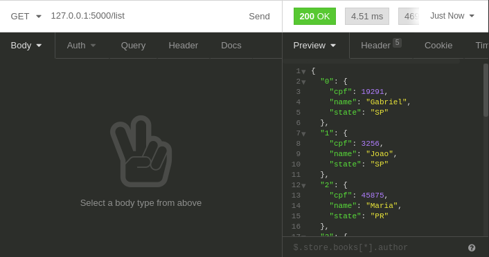
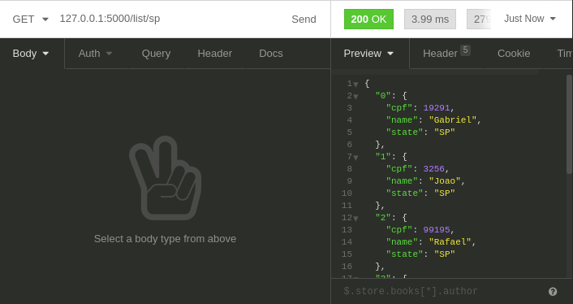
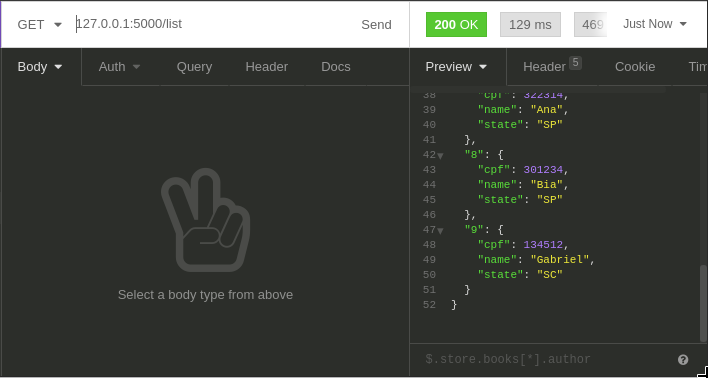
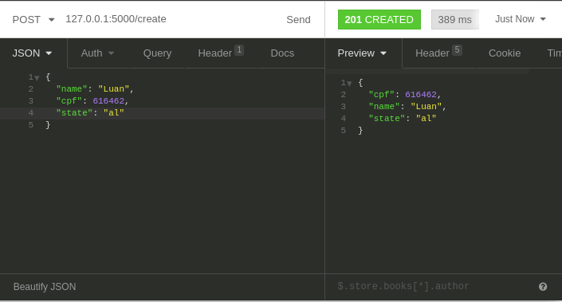
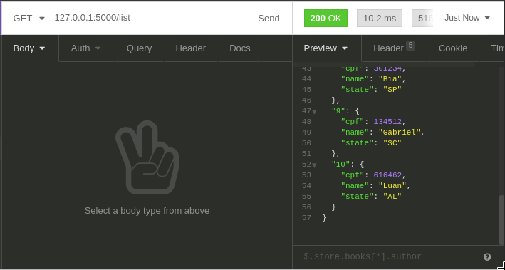
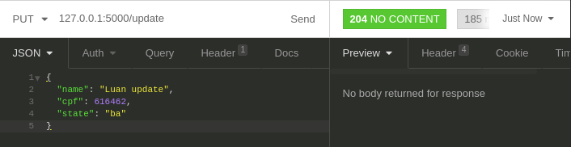
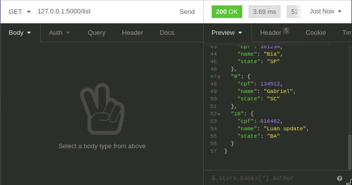
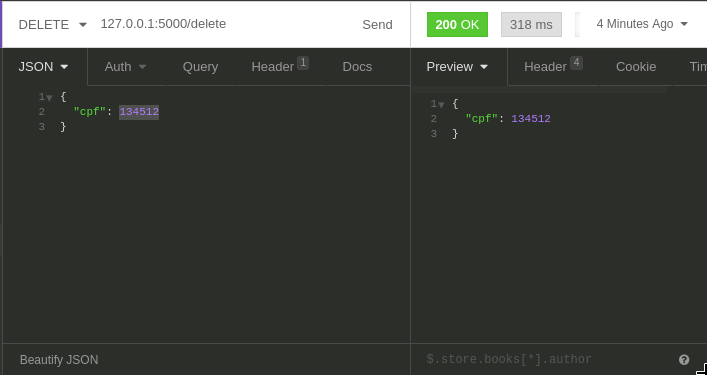
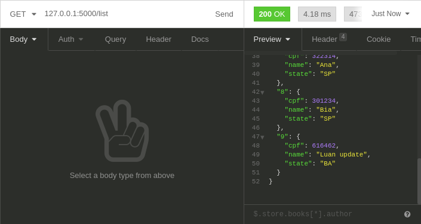

# Simple Crud Flask

## Requirements
- Python
- Conda

## Instalation

First, clone this repository
```
  $ git clone https://github.com/gabrieldomene/flask-simple-crud.git
  $ cd flask-simple-crud
```

Use conda for creating a new environment and installing the requirements
```
  $ conda create --name <env_name> --file requirements.txt
  $ conda activate <env_name>
```

Navigate to the folder and start gunicorn
```
  $ cd app
  $ gunicorn -b 127.0.0.1:5000 app:app
```

The server is now running on port 5000, you can change the port number if you like in the last line.

## Use cases

If there isn't any db file inside database folder, run the `create_db_example.py` for creating a minimum example of data.
```
  $ python create_db_example.py
```

### Listing content inside DB
There is two ways for showing the content of DB, the first one is all of the content saved and the second is passing the state code in the URL. This step can be done via browser or any api application.

1. All content

   methods=[GET] http://127.0.0.1:5000/list/

   

2. Filtered by state

   Insert in the end of URL the state code for filter the results and only show by state

   methods=[GET] http://127.0.0.1:5000/list/sp

   


### Creating a new student

For creating a new user access the endpoint and pass the body desired with some application like insomnia, setting the type for [POST] and body [JSON] with non empty values.

methods=[POST] 127.0.0.1:5000/create

```javascript
{'name': 'Luan', 'cpf': 616462, 'state': 'AL'}
```

1. Before insertion

   List of all content in DB before the insertion
   
   
   
2. Inserted

   Student inserted
   
   

3. List all after insertion

   New list of all students inserted
   
   

### Updating student

For updating a student pass a valid cpf, if there is not matching between a saved cpf and the data passed there will be no update. Use a non empty values inside the body.

methods=[PUT] 127.0.0.1:5000/update

1. Update

   Student fields to be update
   
   
   
2. Inserted

   List of all content in DB after the update in the last student
   
   

### Delete student

Delete a student via cpf number, in the example the removal of the 9th student in DB.

methods=[DELETE] 127.0.0.1:5000/delete

1. Before

   CPF number 134512 for:
   ```javascript
   {'name': 'Gabriel', 'cpf': 134512, 'state': 'SC'}
   ```

   

3. Delete

   Student with cpf number 134512 removal

   

3. After delete

   Student with cpf number 134512 is no longer in the DB

   